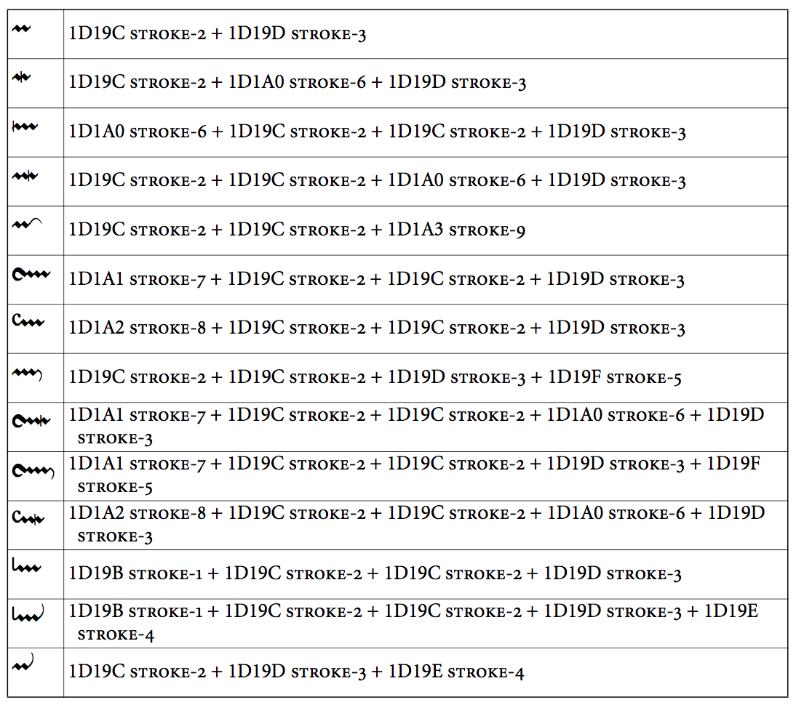

When designing the Unicode Musical Symbols range, Perry Roland elected
to develop a scheme for creating complex ornaments using a series of
glyphs rather than defining precomposed glyphs for every ornament, as
shown below:[^1]

This range expands upon the repertoire of 11 strokes in the Unicode
Musical Symbols range.

The side-bearings for the glyphs in this range must be adjusted
carefully to ensure correct positioning. (Kerning pairs may also be
used.)

Glyphs between **ornamentTopLeftConcaveStroke** and
**ornamentBottomLeftConvexStroke** are designed to be positioned immediately
to the left of and to join seamlessly to **ornamentZigZagLineNoRightEnd**.
**ornamentZigZagLineWithRightEnd** and glyphs between
**ornamentTopRightConcaveStroke** and **ornamentBottomRightConvexStroke** are
designed to be positioned immediately to the right of and to join
seamlessly to **ornamentZigZagLineNoRightEnd**. **ornamentMiddleVerticalStroke**
should be used immediately to the left of either
**ornamentZigZagLineNoRightEnd** or **ornamentZigZagLineWithRightEnd** to
provide correct positioning of the vertical stroke across the zig-zag
line.

[^1]: *Ibid.*, Allen, page 539.
