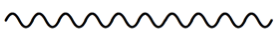
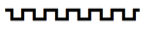

Scoring applications can combine these glyphs to produce lines of varying
lengths. By way of example:

| **Example** | **Uses glyphs**
| ----------- | ---------------
|  | ornamentTrill + wiggleTrillFastest + wiggleTrillFasterStill + wiggleTrillFaster + wiggleTrillFast + wiggleTrill + wiggleTrillSlower + wiggleTrillSlowerStill + wiggleTrill + wiggleTrillFaster + wiggleTrillFasterStill
|  | 10 x wiggleWavy
|  | 10 x wiggleSawtooth
|  | 6 x wiggleSquaretooth
|  | wiggleCircularStart + wiggleCircularLargest + wiggleCircularLargerStill + wiggleCircularLarger + wiggleCircularLarge + wiggleCircularEnd
|  | wiggleVibratoStart + wiggleVibratoSmallestFastest + wiggleVibratoMediumSlower + wiggleVibratoMediumSlowest + wiggleVibratoMediumFaster + wiggleVibratoMediumFasterStill, etc.
|  | beamAccelRit15 + beamAccelRit14 + beamAccelRit13 + beamAccelRit12 + beamAccelRit11 + beamAccelRit10 + beamAccelRit9 + beamAccelRit10 + beamAccelRit11 + beamAccelRit12 + beamAccelRit13 + beamAccelRit14 + beamAccelRit15 + beamAccelRitFinal
