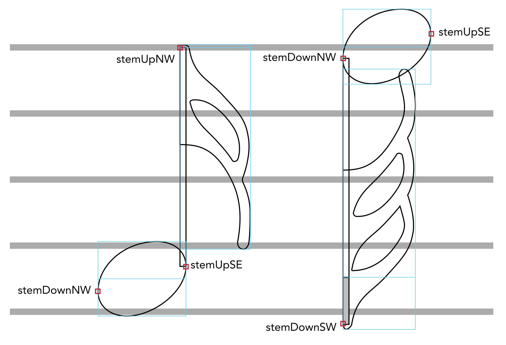

Example of glyph registration for notes with flags
--------------------------------------------------

The figure below shows how font-specific metadata may be used in
conjunction with the conventions of glyph registration to construct two
notes: an up-stem 16th note (semiquaver), and a down-stem 32nd
(demisemiquaver).

-   The horizontal grey lines denote staff lines, for scale.

-   The light blue boxes show glyph bounding boxes, with the left-hand
    side of the box corresponding to x=0, while the horizontal lines
    bisecting the blue boxes show the origin for each glyph, i.e. y=0.

-   The red boxes show the locations of the glyph attachment points, as
    specified in the font metadata JSON file.

-   The shaded area on the down-stem note shows the amount by which a
    stem of standard length (i.e. the unfilled portion of the stem)
    should be extended in order to ensure good on-screen appearance at
    all zoom levels.

Note that the stemUpSE attachment point corresponds to the bottom
right-hand (or south-east) corner of the stem, while stemDownNW
corresponds to the top left-hand (or north-west) corner of the stem.
Likewise, for correct alignment, the flag glyphs must always be aligned
precisely to the left-hand side of the stem, with the glyph origin
positioned vertically at the end of the normal stem length.
