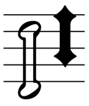

Scoring applications should draw simple note clusters (e.g.
**noteheadClusterSquareWhite**, **noteheadClusterRoundBlack**) directly using
primitives rather than using these glyphs, so that the clusters can be
drawn spanning the correct interval.

The combining glyphs for note clusters are designed to allow the
creation of clusters of any interval larger than a third, with a scoring
application inserting the appropriate number of “middle” segments
between a single instance of the “top” and “bottom” segments:

The left-hand cluster is a stack (top to bottom) of 1 x
**noteheadClusterHalfTop**, 3 x **noteheadClusterHalfMiddle**, 1 x
**noteheadClusterHalfBottom**; the right-hand cluster is 1 x
**noteheadDiamondClusterBlackTop**, 2 x **noteheadDiamondClusterBlackMiddle**, 1
x **noteheadDiamondClusterBlackBottom**.

Clusters for intervals of a second or a third are created using a single
glyph, e.g. **noteheadClusterQuarter2nd**. These glyphs are registered such
that the lowest pitch in the cluster is centered around y = 0, so to
draw correctly, the glyph should be positioned on the staff position
corresponding to the lowest note in the cluster.

*See also* the implementation notes for noteheads.
