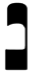
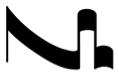
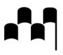
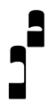
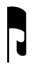

To produce ligatures of three or more notes, some of the glyphs in this
range have to be combined.

Glyphs should be positioned relative to their starting pitch: for
example, the **chantLigaturaDesc3rd** glyph, which describes a downwards
progression by an interval of a third, should be positioned on the staff
line or space of the starting note of the downwards pattern; the
connecting lines (e.g. **chantConnectingLineAsc3rd**) should likewise be
positioned on the staff line or space corresponding to the bottom of the
line; for an ascending liquescent, position **chantAuctumAsc** on the
starting staff position, and **chantDeminutemUpper** on the ending staff
position, with the appropriate length of connecting line between them.

Scoring applications should position these glyphs like any other
notehead, i.e. moving them vertically according to the desired starting
staff position. Fonts intended for use in text-based applications should
include glyphs that present these symbols at different staff positions,
and a means to easily choose between them; one possible implementation
would be to define OpenType ligatures of each of the glyphs in the
**Combining staff positions** range with each of the glyphs in this
range.

The table below shows how to produce some common ligatures, and
describes which glyphs should be used; glyphs whose names appear in
parentheses are control characters that move the following glyph
vertically to a different staff position, as might be used in a font
that employs OpenType ligatures.

| **Example** | **Description** | **Uses glyphs **
| ----------- | --------------- | ----------------
|  | Podatus, ascending 3rd | chantPodatusLower + chantConnectingLineAsc3rd + (staffPosRaise3) + chantPodatusUpper
|  | Clivis, descending 4th | chantPunctumVirgaReversed + (staffPosLower4) chantConnectingLineAsc4th + (staffPosLower4) + chantPunctum
|  | Salicus | chantPunctum + (staffPosRaise1) + chantPodatusLower + (staffPosRaise1) + chantConnectingLineAsc2nd + (staffPosRaise2) + chantPodatusUpper
|  | Climacus | chantPunctumVirga + (staffPosLower1) + chantPunctumInclinatum + (staffPosLower2) + chantPunctumInclinatum
|  | Torculus | chantPunctum + (staffPosRaise1) + chantPunctum + chantPunctum
|  | Porrectus | chantEntryLineAsc5th + (staffPosRaise5) + chantLigaturaDesc4th + (staffPosRaise1) + chantConnectingLineAsc3rd + (staffPosRaise4) + chantPunctum
|  | Scandicus flexus | chantPodatusLower + (staffPosRaise1) + chantConnectingLineAsc2nd + (staffPosRaise2) + chantPodatusUpper + chantPunctumVirga + chantConnectingLineAsc3rd + chantPunctum
|  | Porrectus flexus | chantConnectingLineAsc3rd + (staffPosRaise3) + chantLigaturaDesc3rd + chantPunctumVirga + chantConnectingLineAsc3rd + chantPunctum
|  | Climacus resupinus | chantPunctumVirga + (staffPosRaise1) + chantPunctumInclinatum + chantPunctumInclinatum + (staffPosRaise1) + chantPunctum
|  | Torculus resupinus | chantPunctum + (staffPosRaise1) + chantPunctum + chantPunctum + (staffPosRaise1) + chantPunctumVirga
|  | Pes subbipunctus | chantPodatusLower + (staffPosRaise1) + chantConnectingLineAsc2nd + (staffPosRaise2) + chantPodatusUpper + chantPunctumInclinatum + (staffPosLower1) + chantPunctumInclinatum
|  | Virga praetripunctis | chantPodatusLower + (staffPosRaise1) + chantConnectingLineAsc3rd + (staffPosRaise3) + chantPodatusUpper chantPodatus3rd + (staffPosRaise4) + chantPodatusLower + (staffPosRaise5) + chantConnectingLineAsc2nd + (staffPosRaise6) + chantPodatusUpper
|  | Epiphonus (liquescent podatus) | chantAuctumAsc + (staffPosRaise1) + chantDeminutemUpper
|  | Cephalicus (liquescent flexa) | chantConnectingLineAsc3rd + (staffPosRaise3) + chantAuctumDesc + (staffPosRaise2) + chantDeminutemLower
|  | Pinnosa (liquescent torculus) | chantPunctum + chantConnectingLineAsc4th + (staffPosRaise4) + chantAuctumDesc + (staffPosRaise3) + chantDeminutemLower
|  | Porrectus liquescens | chantPunctumVirgaReversed + (staffPosLower1) + chantAuctumAsc + (staffPosRaise1) + chantDeminutemUpper
|  | Scandicus liquescens | chantPunctum + (staffPosRaise1) + chantAuctumAsc + + (staffPosRaise1) + chantConnectingLineAsc3rd + (staffPosRaise4) + chantDeminutemUpper
